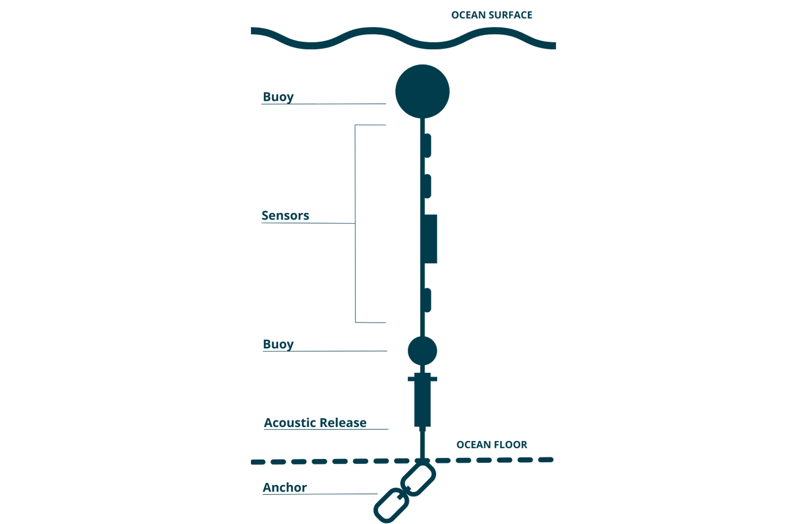

```{r setup, include=FALSE}
knitr::opts_chunk$set(echo = FALSE, dpi = 600)
```

```{r, echo=FALSE, message=FALSE, warning=FALSE}
library(dplyr)
library(ggplot2)
library(ggsflabel)
library(ggspatial)
library(glue)
library(here)
library(knitr)
library(lubridate)
library(purrr)
library(sf)
library(sensorstrings)
library(stringr)
library(viridis)

source(here("functions/subchunkify.R"))
```

 
```{r, import-strings-data}

county <- params$county

# read all rds files for county and rbind together
# - figure out which columns to keep and how to do that cleanly
dat_raw <- suppressMessages(ss_import_data(county = county))

dat <- dat_raw

qc_flags <- colnames(dat_raw)[str_detect(colnames(dat_raw), "qc_flag")]

# filter flags - could move this to function
if ("qc_flag_dissolved_oxygen_percent_saturation" %in% qc_flags) {
  dat <- dat %>% 
    filter(qc_flag_dissolved_oxygen_percent_saturation %in% c(1, 2, NA))
}

if ("qc_flag_dissolved_oxygen_uncorrected_mg_per_l" %in% qc_flags) {
  dat <- dat %>% 
    filter(qc_flag_dissolved_oxygen_uncorrected_mg_per_l %in% c(1, 2, NA))
}

if ("qc_flag_sensor_depth_measured_m" %in% qc_flags) {
  dat <- dat %>% 
    filter(qc_flag_sensor_depth_measured_m %in% c(1, 2, 3, NA))
}

if ("qc_flag_salinity_psu" %in% qc_flags) {
  dat <- dat %>% 
    filter(qc_flag_salinity_psu %in% c(1, 2, 3, NA))
}

if ("qc_flag_temperature_degree_c" %in% qc_flags) {
  dat <- dat %>% 
    filter(qc_flag_temperature_degree_c %in% c(1, 2, 3, NA))
}


# dat <- dat_raw %>% 
#   filter(
#     qc_flag_dissolved_oxygen_percent_saturation %in% c(1, 2) |
#       qc_flag_sensor_depth_measured_m %in% c(1, 2, 3) |
#       qc_flag_salinity_psu %in% c(1, 2, 3) |
#       qc_flag_temperature_degree_c %in% c(1, 2, 3)
#     
#   )


# unique waterbodies
waterbodies <- sort(unique(dat$waterbody))

fig_caption <- " water quality data."
table_caption <- "Deployment details for"

i = 0 # counter for waterbody
k = 1 # counter for figure number
text.size <- 3
crs <- 4326

# stations that have DO below the default range of plot_variables_at_depth
custom_DO_lims <- c(
  "0814x East",
  "0814x West",
  "5008",
  "Aberdeen", 
  "Deep Basin",
  "Hourglass Lake",
  "Monks Head",
  "Piper Lake", 
  "Sissiboo",
  "Tickle Island"
) 

# # dissolved oxygen units considerations
# if("mg/L" %in% unique(dat$UNITS)) {
#   
#   dat <- dat %>%
#     mutate(
#       VARIABLE = case_when(
#         VARIABLE == "Dissolved Oxygen" & UNITS == "percent saturation" ~
#           "Dissolved Oxygen (%)",
#         VARIABLE == "Dissolved Oxygen" & UNITS == "mg/L" ~
#           "Dissolved Oxygen (mg/L)",
#         TRUE ~ VARIABLE
#       )
#     ) 
# 
#   DO.mgL <- TRUE
#   
# } else DO.mgL <- FALSE


```

```{r, map-set-up}

# import NS counties shapefile and remove NA row (should have 18 rows - 1 for each county)
NS <- read_sf(here("shapefiles/Merged_Counties2.shp")) %>%
  na.omit() %>% 
  # add column with "1" for county of interest and "0" for other counties
  mutate(
    COL.COUNTY = if_else(County == county, 1, 0),
    COL.COUNTY = ordered(factor(COL.COUNTY), levels = c(1, 0))
  )

# extract unique station locations and convert to sf object
stations <- dat %>%
  write_report_table(keep.waterbody = TRUE) %>%
  select(Waterbody, Station, Latitude, Longitude) %>%
  distinct(Station, .keep_all = TRUE) %>%
  st_as_sf(
    coords = c("Longitude", "Latitude"), remove = FALSE,
    crs = crs, agr = "constant"
  )

```

\newpage
# Introduction

The Centre for Marine Applied Research (CMAR) measures [essential ocean variables](https://www.goosocean.org/index.php?option=com_content&view=article&layout=edit&id=283&Itemid=441) throughout Nova Scotia’s coastal waters as part of the Coastal Monitoring Program. This program was initiated by the Nova Scotia Department of Fisheries and Aquaculture in 2012 and CMAR became involved in 2017. For more information on CMAR and the Coastal Monitoring Program, visit the [CMAR website](https://cmar.ca/). 

This document presents deployment details and summary figures of Water Quality data collected for **`r county` County** (Figure `r k` and Figure `r k+1`). The data are available for download from the Nova Scotia [Open Data Portal](https://data.novascotia.ca/browse?tags=coastal+monitoring+program) and from the ERDAPP server through the [Canadian Integrated Ocean Observing platform](https://catalogue.cioosatlantic.ca/dataset?q=cmar). 

This document should be considered as a guide only, as data collection and retrieval are ongoing. The information may be revised pending ongoing data collection and analyses. 

```{r, NS-map, message=FALSE, error=FALSE, fig.width=8}

ggplot() +
  geom_sf(data = NS, col = NA, fill = NA) +
  annotation_map_tile(type="cartolight", zoomin = 0) +
  geom_sf(data = NS, col = "black", size = 0.05, aes(fill = COL.COUNTY)) +
  scale_fill_manual(values = c("#1B9E77", NA)) +
  fixed_plot_aspect(ratio = 2) +
  theme(
    panel.border = element_rect(colour = "black", fill = NA, size = 1),
    text = element_text(size = 12),
    axis.title = element_blank(),
    legend.position = "none"
  )

```

Figure `r k`: `r county` County (green).

```{r,  message=FALSE, error=FALSE}
k = k + 1
```


```{r, couny-map, message=FALSE, error=FALSE, warning=FALSE, fig.width=8}

if(county == "Guysborough") text.size <- 2.5

map_params <- import_map_params(county)

station_map <- ggplot() +
  geom_sf(data = map_params$dummy_points) +
  annotation_map_tile(type = "cartolight", zoomin = map_params$zoomin) +
  geom_sf(data = stations) +
  geom_sf_label_repel(
    data = stations, aes(label = Station),
    label.size = NA,
    fill = NA, size = text.size,
    max.overlaps = 40
  ) +
  annotation_scale(location = "br") +
  annotation_north_arrow(
    location = "tl", which_north = "true",
    height = unit(1, "cm"),
    width = unit(1, "cm")
  ) +
  fixed_plot_aspect(ratio = 2) +
  theme(
    panel.border = element_rect(colour = "black", fill = NA, size = 1),
    text = element_text(size = 12),
    axis.title = element_blank()
  )

station_map

```	
<br>


Figure `r k`: Sampling stations in `r county` County.

```{r}
k = k+1
```

\newpage
## Data Collection 

CMAR collects temperature, dissolved oxygen, and intermittent salinity data using autonomous sensors deployed on “sensor strings”. A sensor string typically consists of a line anchored to the sea floor by an acoustic release and suspended by a sub-surface buoy, with sensors attached at various depths below the surface (as measured at low tide; Figure 3). Alternatively, strings may be attached to surface moorings, including floating docks, buoys, and equipment. Sensor strings are typically deployed for several months, and data are measured every 1 minute to 1 hour. Sensors are retrieved for data offload by triggering the acoustic release when applicable, by directly removing from surface moorings, or occasionally by divers or dragging. Sensor strings may be re-deployed at the same location or moved to another area of interest depending on program objectives.

## Data Processing

Some data were excluded from the dataset due to quality control processes.

`r if(DO.mgL){"Dissolved oxygen was measured in units of percent saturation or mg/L, depending on the deployment. Measurements in mg/L were corrected for salinity using the Garcia-Gordon (1992) salinity correction factor with a salinity value of 30.6 practical salinity units (based on available data for the region). This correction factor is not required for values recorded in percent saturation."}`

```{r, echo=FALSE, fig.align='center'}



```

Figure `r k`: Example sensor string configuration (not to scale).

\newpage
# `r county` County Coastal Data

Coastal data is presented by waterbody. For each waterbody, there is a table of deployment details followed by figures showing the data at each station. The Mooring column indicates whether the string was attached to a fixed mooring (does not move vertically with the tide) or floating mooring (e.g., dock, equipment, buoy). A red line is included in temperature figures to indicate the -0.7 °C superchill threshold for salmonids (for figures where the temperature falls below this threshold). Note the different axis scales for each figure.


```{r, report-body, fig.width = 8.5, results = 'hide',  results ='asis', message=FALSE}

for(i in seq_along(waterbodies)){

  waterbody_name <- waterbodies[i]
  waterbody_dat <- dat %>% filter(WATERBODY == waterbody_name)

  stations <-  waterbody_dat %>% select(STATION) %>% distinct() %>% arrange(STATION)
  stations <- stations$STATION 

  cat('\n##', waterbody_name, '\n')

  cat('\n')

  # waterbody table
  table <- write_report_table(waterbody_dat, keep.waterbody = FALSE)
  
  print(
    kable(table, align = "c",
          caption = glue("Table {i}: {table.caption} {waterbody_name}.")
    )
  )

  # plot for each station
  for(j in 1:length(stations)){

    k = k + 1
    station.j <- stations[j] # station of interest

    # subset data to station of interest
    station_dat <- waterbody_dat %>% 
      filter(STATION == station.j) %>%
      convert_depth_to_ordered_factor()
    
    # y-limts for DO
    if(station.j %in% custom_DO_lims){
      standard_lims = FALSE
    } else standard_lims = TRUE
    
    # height of figure j
    n.vars <- length(unique(station_dat$VARIABLE))
    if(n.vars == 1) h = 2.5
    if(n.vars == 2) h = 5
    if(n.vars == 3) h = 7.5
    if(n.vars == 4) h = 10
    
    p <- plot_variables_at_depth(station_dat, standard.DO.ylims = standard_lims)
    
    cat('\n###', station.j, '\n')
     
    subchunkify(p, fig_height = h, fig_width = 8.5)
    
    cat(paste("Figure ", k, ": ", station.j, fig.caption,  sep = ""), '\n')
    
    cat('\n')
  }
}

```

`r if(DO.mgL){"# Reference \nGarcia, H. E., and Gordon, L. I. (1992). Oxygen solubility in seawater: better fitting equations. Limnol. Oceanogr. 37, 1307–1312. doi: 10.4319/lo.1992.37.6.1307"}`

\newpage
# Document History

```{r}
i = i +1

params$doc.hist %>% 
  select(-County) %>% 
  kable(
    align = "ccl", caption = glue("Table {i}: Document history.")
  )

```

